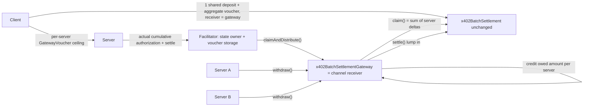

# Extension: `voucher-gateway`

## Summary

The `voucher-gateway` extension layers on top of the EVM [`batch-settlement`](../schemes/batch-settlement/scheme_batch_settlement_evm.md) scheme to offer **facilitator-managed voucher storage** behind a shared **gateway contract**. It targets two goals:

1. **Simpler server setup.** The server stores no per-channel voucher state and runs no asynchronous claim/settle scheduling. The facilitator owns all channel and per-server state and orchestrates redemption. The server presents a 402, proxies the payment to the facilitator, serves the resource, authorizes the actual charge (directly or by delegation), and optionally withdraws its accrued funds.
2. **A shared client deposit across many servers.** The client funds **one** channel whose onchain `receiver` and `receiverAuthorizer` are a facilitator-deployed **gateway contract**. The wire-level `payTo` remains the server payout address and the wire-level `extra.receiverAuthorizer` remains the authority over that server's actual charge. Because neither server-specific address enters `ChannelConfig`, the same deposit pays many servers behind the gateway.

The extension introduces no changes to the [`x402BatchSettlement`](../../contracts/evm/src/x402BatchSettlement.sol) contract. It adds one new contract, `x402BatchSettlementGateway` (one deployment per facilitator), that acts as the channel `receiver` and `receiverAuthorizer`, performs internal per-receiver accounting from **payer-signed** per-receiver ceilings (`GatewayVoucher`) and **receiver-authorizer-signed** claim amounts (`GatewayClaimAuthorization.totalClaimed`), and distributes settled funds to servers. Per-server attribution is trust-minimized: the facilitator cannot change the client-authorized recipient or ceiling, and cannot increase an actual charge unless the server delegated its `receiverAuthorizer` role to the facilitator.

**Wire format convention.** `/verify` and `/settle` reuse the base scheme's own `payload.type` values (`deposit`, `voucher`, `claim`, `settle`) unchanged — this extension never introduces new type strings. Everywhere this extension's messages overlap with the base scheme — the 402 `accepts[]` entry, `/verify`, `/settle`, and the client-facing payment response — the overlapping fields keep the exact base-scheme shape under `extra` (or `accepts[].extra`). Every field this extension introduces is carried in the `extensions["voucher-gateway"]` envelope instead, and mirrors the base scheme's own wire shapes wherever an analogous concept exists: a per-server `gatewayConfig` (`channelId`, `receiver`, `receiverAuthorizer`) mirrors `channelConfig`, and a per-server `gatewayVoucher` (`gatewayId`, `maxClaimableAmount`, `signature`) mirrors the base `voucher` (`channelId`, `maxClaimableAmount`, `signature`). The client signs the small per-server ceiling message referencing a separately-hashed, immutable identity binding — exactly as the base scheme's `Voucher` references `channelId` rather than re-signing the full `ChannelConfig` on every request. The aggregate channel voucher is signed on deposit/top-up and echoed thereafter. Examples below always show the complete message, not just the extension fragment.

**Behavioral deltas from the base scheme.** Two behaviors differ from the base scheme even though the wire types are unchanged: (1) a `voucher`-typed request MUST call `/settle` on every request — unlike the base scheme, where `/settle` is skipped per request and only called later, in bulk, at the server's discretion — because `/settle` is how the stateless server tells the facilitator the resource handler succeeded and reports the actual amount (`<= amount`) to commit; and (2) a `settle`-typed `/settle` call, which in the base scheme moves claimed funds to `receiver` directly, additionally makes the facilitator call the gateway's `withdraw` for the server named in the extension info, since `receiver` is always the gateway itself and a bare base `settle` would otherwise leave funds credited but stuck in the gateway.

---

## Goals and non-goals

| | In scope | Out of scope |
| --- | --- | --- |
| Server | Stateless request handling, no voucher store, no claim/settle scheduling; authorizes actual charges directly or delegates that role | Running its own channel state |
| Client | One shared deposit per `(payer, gateway, token)` funding many servers | One channel per server |
| Facilitator | Owns voucher storage and orchestrates atomic claim + settle + credit, but never custodies funds | Choosing recipients or actual charges without the required signatures |
| Attribution | Client-signed server/authorizer/ceiling plus receiver-authorizer-signed actual cumulative | Facilitator-attributed splits the client or receiver authorizer did not sign |
| Money movement | Deposit, claim, settle, per-server distribution, server withdrawal, base payer timed withdrawal | Gateway-authorized cooperative refunds |

---

## Architecture



### Two nested channels

Gateway mode nests two unidirectional payment channels:

1. **Channel 1** (`x402BatchSettlement`): payer → gateway. Uses base notation: `ChannelConfig`, `Voucher`, and `ChannelDistribution.voucher` / `.signature`.
2. **Channel 2** (this gateway): gateway → receiver. Uses `GatewayConfig` / `gatewayId`, `GatewayVoucher` / `gatewaySignature`, and `GatewayVoucherClaim` with `GatewayClaimAuthorization.totalClaimed`. Channel 2's `payerAuthorizer` is the same identity as channel 1's.

### Roles

- **Client (payer).** Opens a single channel whose `receiver` and `receiverAuthorizer` are the gateway contract and deposits once. Signing cadence mirrors the base scheme's "client max / receiver actual" pattern, nested one level:
  - On each **`deposit`** (open or top-up), the client signs **two** EIP-712 messages: an aggregate `Voucher(channelId, maxClaimableAmount)` for `x402BatchSettlement` with `maxClaimableAmount` equal to the channel balance after the deposit (the max the gateway may ever claim from escrow), and a `GatewayVoucher(gatewayId, maxClaimableAmount)` for the request's server.
  - On each subsequent **`voucher`** request, the client signs **only** a new `GatewayVoucher` — the per-server ceiling, where `gatewayId` is the hash of a `GatewayConfig(channelId, receiver, receiverAuthorizer)` binding that server's payout address and actual-charge authority. The client **echoes** the last deposit-signed aggregate voucher in `payload.voucher` without re-signing it.
  - The aggregate ceiling is the base-scheme-style max to the channel receiver (the gateway). Unlike the base scheme, the gateway cannot choose the claimed actual: `claimAndDistribute` derives `totalClaimed` as the sum of per-server deltas, each bounded by a client `GatewayVoucher` and a receiver-authorizer `GatewayClaimAuthorization`.
- **Server.** Presents a 402 with its payout address as `payTo` and an `extra.receiverAuthorizer` that controls its actual charge. It proxies verification to the facilitator, serves the resource, then authorizes the actual cumulative itself with a hot wallet or asks a delegated facilitator authorizer to sign after authenticating the server. It keeps **no** voucher state and triggers **no** onchain settlement. It optionally withdraws accrued funds directly from the gateway, or requests a facilitator-relayed withdrawal with a `settle`-typed `/settle` call (see [Server withdrawal](#server-withdrawal)).
- **Facilitator.** The state owner and transaction relayer. It publishes the gateway and canonical `withdrawDelay` in `supported`, stores the deposit-signed aggregate voucher per channel and per-`(channel, server)` signed state, exposes `verify` / `settle` / `supported`, and periodically calls `claimAndDistribute` on its gateway (reusing the stored aggregate voucher, optionally with only a subset of servers). It never custodies funds: value flows contract-to-contract (`x402BatchSettlement` → gateway) and then to servers.
- **Gateway contract.** A facilitator-deployed contract that is the channel `receiver` and `receiverAuthorizer`. It is the only path that can claim shared channels, atomically pulls claimed funds in, verifies the client and wire-level receiver-authorizer signatures, credits each server its authorized actual share, and lets servers withdraw.

### Why a gateway enables a shared deposit

In the base scheme, `channelId = EIP712Hash(ChannelConfig)` and the wire-level `payTo` and `extra.receiverAuthorizer` map directly to `ChannelConfig.receiver` and `ChannelConfig.receiverAuthorizer`. A channel therefore binds to one server configuration. Gateway mode overrides that mapping: both onchain fields are the gateway, while `payTo` and `extra.receiverAuthorizer` are bound inside the client-signed `GatewayConfig`, whose hash (`gatewayId`) the client-signed `GatewayVoucher` ceiling references. One channel — and one deposit — therefore binds to `(payer, gateway, token, withdrawDelay)` and serves every participating server.

---

## Relationship to the base scheme

This extension **reuses unchanged**:

- **Deposits.** The client deposits into the channel exactly as in the base scheme (`eip3009` or `permit2` via the canonical deposit collectors), with `receiver` set to the gateway. The facilitator sponsors the deposit (gasless for the client).
- **Channel identity.** `channelId = EIP712Hash(ChannelConfig)` under the `x402 Batch Settlement` domain, bound to the chain and the `x402BatchSettlement` address.
- **The channel-1 voucher.** `Voucher(bytes32 channelId, uint128 maxClaimableAmount)` and the cumulative, monotonic claim model (`totalClaimed <= maxClaimableAmount <= balance`). In gateway mode this voucher is signed on deposit/top-up (typically `maxClaimableAmount = balance`) and reused for redemption; it is not re-signed on every request. On `ChannelDistribution` it is carried as `voucher` / `signature` (base notation).
- **Claim and settle on `x402BatchSettlement`.** Funds reach the gateway through the standard `claim` + `settle(receiver=gateway, token)` flow. No contract change is required because the gateway is just an EVM address acting as `receiver`.

This extension **adds**:

- **The gateway contract** `x402BatchSettlementGateway` as the onchain `receiver` and `receiverAuthorizer`; wire-level `payTo` remains the server.
- **A channel-2 config and voucher.** `GatewayConfig(channelId, receiver, receiverAuthorizer)` binds one receiver's payout address and actual-charge authority to the shared channel 1; its hash `gatewayId` is referenced by a small payer-signed `GatewayVoucher(gatewayId, maxClaimableAmount)` ceiling — mirroring `ChannelConfig` / `channelId` / `Voucher` in the base scheme — signed by the same payer authorization identity as the channel-1 voucher, carried in the extension envelope, and freshly signed on **every** paid request (deposit or voucher).
- **A channel-2 claim authorization** (`GatewayClaimAuthorization`) over the exact gateway-voucher digest and `totalClaimed`, signed by the wire-level `receiverAuthorizer`.
- **Per-receiver (channel-2) accounting and distribution** in the gateway (`claimAndDistribute`, `withdraw`).
- **Facilitator-owned storage** of all channel and per-server voucher state, replacing the base scheme's server-owned per-channel state.

The base scheme's "Server: State & Forwarding" responsibilities move to the facilitator. The server's per-channel state table (`chargedCumulativeAmount`, `signedMaxClaimable`, `signature`, mirrored onchain fields) is maintained by the facilitator instead, split into an aggregate record per channel and a record per `(channel, server)`. The server still controls the actual amount through the same `receiverAuthorizer` role used by the base scheme.

---

## Gateway contract: `x402BatchSettlementGateway`

One gateway is deployed per facilitator. The following is a normative **interface sketch and behavior**, not a full reference implementation.

### EIP-712 domain and types

The gateway defines its own EIP-712 domain, bound to the gateway deployment so neither authorization can be replayed against a different gateway or chain:

```javascript
{
  name: "x402 Batch Settlement Gateway",
  version: "1",
  chainId: <evm chain id>,
  verifyingContract: <gateway address>
}
```

```solidity
// GatewayConfig type hash
keccak256("GatewayConfig(bytes32 channelId,address receiver,address receiverAuthorizer)")

// GatewayVoucher type hash — the signed message references `gatewayId` (the hash of GatewayConfig), not the
// raw config, mirroring how the base scheme's Voucher digest references `channelId` rather than `ChannelConfig`
keccak256("GatewayVoucher(bytes32 gatewayId,uint128 maxClaimableAmount)")

// GatewayClaimAuthorization type hash
keccak256("GatewayClaimAuthorization(bytes32 gatewayVoucherDigest,uint128 totalClaimed)")
```

`GatewayConfig.channelId` is the channel on `x402BatchSettlement` (computed under that contract's domain, so it is already chain- and settlement-bound). `GatewayConfig.receiver` is the wire-level `payTo` and final payout address. `GatewayConfig.receiverAuthorizer` is the wire-level `extra.receiverAuthorizer`: a server hot wallet, an EIP-1271 server wallet, or a facilitator authorizer to which the server delegated after arranging authenticated access.

`gatewayId = EIP712Hash(GatewayConfig)` under the gateway's own domain — exactly as `channelId = EIP712Hash(ChannelConfig)` under the base contract's domain. This two-tier structure exists for the same reason the base scheme uses it: a channel-scoped identity is established once, and each request signs only the small `GatewayVoucher(gatewayId, maxClaimableAmount)` ceiling that references it, instead of re-signing the full config every time.

`GatewayVoucher.maxClaimableAmount` is the payer-authorized cumulative ceiling for that `(channel, receiver)` pair — named to match the base scheme's own `Voucher.maxClaimableAmount`.

`GatewayClaimAuthorization.gatewayVoucherDigest` is the gateway-domain EIP-712 digest of the exact payer-signed `GatewayVoucher`. `totalClaimed` is the cumulative amount the receiver authorizer permits the gateway to credit (same field name as base `VoucherClaim.totalClaimed`). Binding the claim authorization to the voucher digest prevents an actual authorization from being paired with a different config, receiver, or ceiling.

### Interface

```solidity
// SPDX-License-Identifier: MIT
pragma solidity ^0.8.20;

import {x402BatchSettlement} from "./x402BatchSettlement.sol";

/// @title x402BatchSettlementGateway
/// @notice Channel receiver and receiver-authorizer for the `voucher-gateway` extension.
/// @dev Two nested channels: channel 1 uses base `voucher`/`signature`; channel 2 uses Gateway* types.
interface Ix402BatchSettlementGateway {
    /// @notice Payer-signed per-receiver identity binding (channel 2), mirroring `ChannelConfig`.
    struct GatewayConfig {
        bytes32 channelId;          // parent channel on x402BatchSettlement
        address receiver;           // wire payTo and final payout address
        address receiverAuthorizer; // wire extra.receiverAuthorizer
    }

    /// @notice Payer-signed per-receiver cumulative authorization (channel 2), mirroring `Voucher`.
    /// @dev Digest covers only `(gatewayId, maxClaimableAmount)`; `config` is calldata convenience.
    struct GatewayVoucher {
        GatewayConfig config;
        uint128 maxClaimableAmount;
    }

    /// @notice Receiver-authorizer-signed actual cumulative bound to one exact GatewayVoucher.
    /// @dev `totalClaimed` matches the base scheme's claim amount field name.
    struct GatewayClaimAuthorization {
        bytes32 gatewayVoucherDigest;
        uint128 totalClaimed;
    }

    /// @notice One channel-2 claim: payer GatewayVoucher plus receiver-authorizer authorization.
    struct GatewayVoucherClaim {
        GatewayVoucher voucher;
        bytes gatewaySignature;
        GatewayClaimAuthorization claim;
        bytes receiverAuthorizerSignature;
    }

    /// @notice One channel-1 redemption: base voucher plus channel-2 split.
    /// @dev Channel 1 uses base notation (`voucher`, `signature`). Gateway derives totalClaimed.
    struct ChannelDistribution {
        x402BatchSettlement.Voucher voucher;
        bytes signature;
        GatewayVoucherClaim[] claims;
    }

    event Distributed(
        bytes32 indexed channelId,
        address indexed receiver,
        address indexed token,
        uint128 amount,
        uint128 newDistributedCumulative
    );
    event Withdrawn(address indexed receiver, address indexed token, address indexed sender, uint128 amount);

    /// @notice Atomically claims channel-1 vouchers, settles into this gateway, and credits each receiver.
    /// @param distributions Per-channel base voucher + per-receiver (channel-2) split.
    function claimAndDistribute(ChannelDistribution[] calldata distributions) external;

    /// @notice Transfers a receiver's accrued balance for a token to that receiver's payout address.
    /// @dev Permissionless (relay-friendly).
    function withdraw(address receiver, address token) external;

    function distributedCumulative(bytes32 channelId, address receiver) external view returns (uint128);
    function distributedByChannel(bytes32 channelId) external view returns (uint128);
    function withdrawable(address receiver, address token) external view returns (uint128);
    function totalOutstanding(address token) external view returns (uint128);
    function getGatewayId(GatewayConfig calldata config) external view returns (bytes32);
    function getGatewayVoucherDigest(bytes32 gatewayId, uint128 maxClaimableAmount) external view returns (bytes32);
    function getGatewayClaimAuthorizationDigest(GatewayClaimAuthorization calldata claim) external view returns (bytes32);

    /// @notice The immutable x402BatchSettlement deployment this gateway settles against.
    function SETTLEMENT() external view returns (address);
}
```

### State

| Field | Type | Description |
| --- | --- | --- |
| `distributedCumulative[channelId][receiver]` | `uint128` | Cumulative amount already credited to `receiver` from `channelId`. Monotonic; gives replay protection exactly like onchain `totalClaimed`. |
| `distributedByChannel[channelId]` | `uint128` | Total amount credited across all receivers from a channel. MUST equal that channel's base-contract `totalClaimed` at every completed gateway transaction. |
| `withdrawable[receiver][token]` | `uint128` | Receiver's accrued, not-yet-withdrawn balance for a token. |
| `totalOutstanding[token]` | `uint128` | Aggregate accrued, not-yet-withdrawn receiver liabilities for a token. |

### `claimAndDistribute` behavior

For each `ChannelDistribution`, with `config = voucher.channel`, `channelId = x402BatchSettlement.getChannelId(config)`, and `token = config.token`:

1. **Gateway binding.** Both `config.receiver` and `config.receiverAuthorizer` MUST equal `address(this)`. The call MUST NOT contain a duplicate `channelId`.
2. **Exclusive-path accounting.** Read the base-contract `totalClaimed` for `channelId` and require it to equal `distributedByChannel[channelId]`. A mismatch means a claim occurred outside the atomic gateway path; the gateway MUST revert rather than double-count or allocate an unexplained claim.
3. **Per-receiver (channel-2) authorization and deltas.** For each `GatewayVoucherClaim` in `claims`:
   - Require that the call contain no other claim for the same `(channelId, voucher.config.receiver)` pair.
   - Require `voucher.config.channelId == channelId`. This check is mandatory: without it, a config from another channel or token could be paired with this channel-1 claim.
   - Compute `gatewayId = getGatewayId(voucher.config)` and the voucher digest `getGatewayVoucherDigest(gatewayId, voucher.maxClaimableAmount)`.
   - Verify `gatewaySignature` over that digest against `config.payerAuthorizer` (ECDSA) or, if it is `address(0)`, against `config.payer` (via `SignatureChecker`, EIP-1271). This is the same payer authorization identity that signs the channel-1 `voucher` / `signature`.
   - Require `claim.gatewayVoucherDigest` equals that digest.
   - Verify `receiverAuthorizerSignature` over `getGatewayClaimAuthorizationDigest(claim)` against `voucher.config.receiverAuthorizer` via `SignatureChecker`. This preserves the base scheme's receiver-authorizer semantics: the receiver controls the actual charge unless it delegated that authority.
   - Require `claim.totalClaimed <= voucher.maxClaimableAmount`.
   - If `claim.totalClaimed <= distributedCumulative[channelId][voucher.config.receiver]`, treat the row as a no-op. Otherwise set `delta = claim.totalClaimed - distributedCumulative[channelId][voucher.config.receiver]`.
4. **Derived channel-1 claim.** Let `channelDelta` be the sum of nonzero receiver deltas and require it to be nonzero. Set `newTotalClaimed = distributedByChannel[channelId] + channelDelta`. The gateway constructs the base `VoucherClaim` using `voucher`, `signature`, and this derived `newTotalClaimed`; callers cannot choose the claim amount. `x402BatchSettlement` verifies the channel-1 payer signature and enforces `newTotalClaimed <= voucher.maxClaimableAmount` and `newTotalClaimed <= balance`. A full-balance channel-1 voucher therefore does **not** move the full escrow: only the sum of included receiver deltas is claimed.
5. **Atomic base claim and settlement.** After validating every distribution, call `x402BatchSettlement.claim` once with all derived voucher claims. Then call `x402BatchSettlement.settle(address(this), token)` once for each distinct token in the call. Because the gateway is the channel `receiver`, it calls `claim` directly; no base `ClaimBatch` signature is needed.
6. **Credit receivers.** For each nonzero delta, set `distributedCumulative[channelId][receiver]` to its authorized `totalClaimed`; increase `distributedByChannel[channelId]`, `withdrawable[receiver][token]`, and `totalOutstanding[token]` by the delta; and emit `Distributed`. No-op rows MUST NOT decrease or otherwise change gateway state.
7. **Solvency post-condition.** For every affected token, require the gateway's token balance to be at least `totalOutstanding[token]`.

The operation is atomic: any invalid row or failed base call reverts the entire selected batch. Relayers SHOULD pre-simulate and submit bounded batches for gas and failure isolation. At successful completion, each channel's newly claimed amount equals its newly credited amount, and all receiver liabilities are backed by tokens held by the gateway. The gateway MUST NOT expose another function that forwards a base `claim`, and MUST NOT validate arbitrary base `ClaimBatch` signatures through EIP-1271.

The same deposit-signed channel-1 voucher MAY be reused across many `claimAndDistribute` calls for that channel (including calls that each include only a subset of receivers with pending deltas), as long as each call's derived `newTotalClaimed` remains `<= voucher.maxClaimableAmount`. A new channel-1 signature is required only when the payer raises the global ceiling via a deposit/top-up.

### `withdraw` behavior

`withdraw(receiver, token)` transfers `withdrawable[receiver][token]` to `receiver`, zeroes that balance, and decreases `totalOutstanding[token]` by the same amount before transferring, emitting `Withdrawn`. It is permissionless so the facilitator can relay it (gasless for the server). Funds always go to the wire-level `payTo` address that the client authorized as `GatewayConfig.receiver`; the caller cannot redirect them. Settled funds remain in the gateway contract until withdrawn, but no facilitator-controlled account ever has custody.

### Deployment

Each facilitator deploys and operates its own gateway. The gateway's `SETTLEMENT()` MUST be the canonical `x402BatchSettlement` deployment for the chain (`0x4020074e9dF2ce1deE5A9C1b5c3f541D02a10003`). Servers learn the gateway address and canonical `withdrawDelay` from the facilitator's `supported` response and MUST copy both into their 402 configuration. Clients learn the gateway from extension `info.gateway` and MUST validate it against the facilitator configuration they trust (see [Verification Rules](#verification-rules) and [Trust and Security](#trust-and-security)).

---

## Channel configuration in gateway mode

The client builds a base-scheme `ChannelConfig` for the shared deposit — distinct from the per-server `GatewayConfig` this extension introduces below — with three fields fixed by this extension:

| Field | Value in gateway mode |
| --- | --- |
| `payer` | Client wallet |
| `payerAuthorizer` | Client voucher-signing EOA, or `address(0)` for EIP-1271 via `payer` |
| `receiver` | **The gateway contract address** from extension `info.gateway` |
| `receiverAuthorizer` | **The same gateway contract address** |
| `token` | ERC-20 payment token |
| `withdrawDelay` | Facilitator policy copied by the server from `supported` into `extra.withdrawDelay` |
| `salt` | Client-chosen and reused for the client's shared `(gateway, token, withdrawDelay)` channel |

Because both server-specific addresses (`payTo` and wire-level `extra.receiverAuthorizer`) are excluded from `ChannelConfig`, a single channel and deposit are shared across all servers using the same gateway, token, withdraw delay, payer settings, and salt. Changing any channel field, including facilitator `withdrawDelay` policy, creates a new channel.

---

## 402 Response (`PaymentRequired`)

The `accepts[]` entry uses the base `batch-settlement` scheme and preserves the normal wire semantics: `payTo` is the server payout address and `extra.receiverAuthorizer` controls the server's actual charge. The gateway-specific data is carried in the v2 `extensions` envelope under the key `voucher-gateway`.

Gateway-aware clients MUST override the base scheme's direct field mapping when constructing `ChannelConfig`: extension `info.gateway` supplies both onchain `receiver` and onchain `receiverAuthorizer`. The wire-level `payTo` and `extra.receiverAuthorizer` instead enter the client-signed `GatewayConfig`.

```json
{
  "x402Version": 2,
  "resource": {
    "url": "https://api.example.com/premium-data",
    "description": "Access to premium market data",
    "mimeType": "application/json"
  },
  "accepts": [
    {
      "scheme": "batch-settlement",
      "network": "eip155:8453",
      "amount": "1000",
      "asset": "0x833589fCD6eDb6E08f4c7C32D4f71b54bdA02913",
      "payTo": "0xServerPayoutAddress",
      "maxTimeoutSeconds": 3600,
      "extra": {
        "receiverAuthorizer": "0xServerHotWalletOrDelegatedFacilitatorAddress",
        "withdrawDelay": 900,
        "name": "USDC",
        "version": "2"
      }
    }
  ],
  "extensions": {
    "voucher-gateway": {
      "info": {
        "gateway": "0xGatewayContractAddress"
      },
      "schema": {
        "$schema": "https://json-schema.org/draft/2020-12/schema",
        "type": "object",
        "properties": {
          "gateway": { "type": "string", "description": "Gateway contract address used as ChannelConfig.receiver and ChannelConfig.receiverAuthorizer" },
          "gatewayConfig": {
            "type": "object",
            "description": "Client-appended per-server identity binding (present in PaymentPayload), mirroring the base scheme's channelConfig",
            "properties": {
              "channelId": { "type": "string" },
              "receiver": { "type": "string" },
              "receiverAuthorizer": { "type": "string" }
            },
            "required": ["channelId", "receiver", "receiverAuthorizer"]
          },
          "gatewayVoucher": {
            "type": "object",
            "description": "Client-appended per-server voucher (present in PaymentPayload), mirroring the base scheme's voucher",
            "properties": {
              "gatewayId": { "type": "string" },
              "maxClaimableAmount": { "type": "string" },
              "signature": { "type": "string" }
            },
            "required": ["gatewayId", "maxClaimableAmount", "signature"]
          },
          "claimAuthorization": {
            "type": "object",
            "description": "Receiver-authorizer-appended claim amount (present in the settle request); binds implicitly to the gatewayVoucher already on the request, so it carries no digest of its own. Mirrors base VoucherClaim.totalClaimed.",
            "properties": {
              "totalClaimed": { "type": "string" },
              "signature": { "type": "string" }
            },
            "required": ["totalClaimed", "signature"]
          }
        },
        "required": ["gateway"]
      }
    }
  }
}
```

| Field | Type | Required | Description |
| --- | --- | --- | --- |
| `info.gateway` | `string` | yes | Gateway contract address. The client MUST use it as both `ChannelConfig.receiver` and `ChannelConfig.receiverAuthorizer`. |

The presence of the `voucher-gateway` extension in the 402 activates gateway mode. `accepts[].payTo` remains the server payout address and MUST become `gatewayConfig.receiver`; `accepts[].extra.receiverAuthorizer` MUST become `gatewayConfig.receiverAuthorizer`. The client signals gateway mode back on the wire by appending the extension envelope (with its `gatewayConfig` and `gatewayVoucher`) to an otherwise-ordinary base-scheme `deposit` or `voucher` payload (see [Client: payment construction](#client-payment-construction)); `payload.type` itself is unchanged. A client that does not implement this extension will submit a payload with no `gatewayConfig`/`gatewayVoucher` and construct the wrong `ChannelConfig`; the facilitator MUST reject any payload against a gateway channel that lacks a valid extension envelope before processing any deposit.

---

## Client: payment construction

Gateway-mode payloads reuse the base scheme's `deposit` and `voucher` `payload.type` values unchanged; each is **identical in shape** to its base-scheme counterpart (same `channelConfig`, `voucher`, and, for deposits, `deposit.authorization` fields). Gateway mode is signaled by the presence of a valid `extensions["voucher-gateway"]` envelope, not by a different `type` string.

The client builds the base scheme's `ChannelConfig` exactly as usual (per [Channel configuration in gateway mode](#channel-configuration-in-gateway-mode)), keeps `payload.type` as `deposit` or `voucher`, then **appends** the per-server `gatewayConfig` and `gatewayVoucher` to the extension envelope. Per the v2 rule, the client echoes the server-provided `info.gateway` and appends its own fields without deleting or overwriting received fields.

### Signing cadence

| Payload | Fresh client signatures | Aggregate `payload.voucher` |
| --- | --- | --- |
| `deposit` (open or top-up) | Aggregate `Voucher` **and** `GatewayVoucher` | Newly signed; `maxClaimableAmount` MUST equal the channel `balance` after this deposit |
| `voucher` (steady state) | **`GatewayVoucher` only** | Echo of the last deposit-signed aggregate (same `maxClaimableAmount` and `signature`); MUST NOT raise or replace the aggregate without a deposit |

This matches the base-scheme trust shape — client authorizes a max, the receiver side chooses the actual within that max — with the gateway unable to choose the channel-level actual itself: onchain claim amount is always the sum of included per-server deltas.

### Cumulative ceilings

The client maintains:

- `serverChargedCumulative[server]` — the actual charged to each server (from verified `GatewayClaimAuthorization`s).
- `aggregateChargedCumulative` — the sum of per-server actuals across the channel (for local accounting / top-up decisions). This value is **not** re-encoded into a freshly signed aggregate voucher on every request.

For a request of maximum price `amount` to server `S`, the client always signs a `GatewayVoucher` for `S` with:

```
gatewayId = getGatewayId({channelId, receiver: payTo, receiverAuthorizer: extra.receiverAuthorizer})
maxClaimableAmount = serverChargedCumulative[S] + amount
```

On `deposit` only, the client also signs the aggregate voucher with `maxClaimableAmount` equal to the post-deposit channel balance (the global escrow cap). On `voucher` requests it reuses that signature by echoing it in `payload.voucher`.

Safety during redemption:

```
new channel totalClaimed = prior totalClaimed + Σ server deltas
new channel totalClaimed <= aggregate maxClaimableAmount
new channel totalClaimed <= balance
each server totalClaimed <= GatewayVoucher.maxClaimableAmount
```

A maxed aggregate voucher alone cannot drain escrow: without client `GatewayVoucher`s and matching `GatewayClaimAuthorization`s, `claimAndDistribute` has no nonzero deltas to claim. Dynamic pricing may leave unused room in a per-server ceiling (e.g. authorize 10, charge 7); that unused room is not reclaimed into other servers' ceilings.

### Voucher payload

Steady-state requests freshly sign only the `GatewayVoucher`. The aggregate `payload.voucher` is the echo of the last deposit-signed voucher (here `maxClaimableAmount` remains the full funded balance, not `charged + amount`):

```json
{
  "x402Version": 2,
  "accepted": { "...": "..." },
  "payload": {
    "type": "voucher",
    "channelConfig": {
      "payer": "0xClientAddress",
      "payerAuthorizer": "0xClientPayerAuthorizerEOA",
      "receiver": "0xGatewayContractAddress",
      "receiverAuthorizer": "0xGatewayContractAddress",
      "token": "0x833589fCD6eDb6E08f4c7C32D4f71b54bdA02913",
      "withdrawDelay": 900,
      "salt": "0x0000000000000000000000000000000000000000000000000000000000000000"
    },
    "voucher": {
      "channelId": "0xabc123...channelId",
      "maxClaimableAmount": "100000",
      "signature": "0x...EIP-712 aggregate voucher signature from last deposit"
    }
  },
  "extensions": {
    "voucher-gateway": {
      "info": {
        "gateway": "0xGatewayContractAddress",
        "gatewayConfig": {
          "channelId": "0xabc123...channelId",
          "receiver": "0xServerPayoutAddress",
          "receiverAuthorizer": "0xServerHotWalletOrDelegatedFacilitatorAddress"
        },
        "gatewayVoucher": {
          "gatewayId": "0x...GatewayConfig digest",
          "maxClaimableAmount": "2000",
          "signature": "0x...EIP-712 GatewayVoucher signature"
        }
      }
    }
  }
}
```

### Deposit payload

The `payload` is identical in shape to the base-scheme `deposit` payload — `payload.type` stays `deposit`, `channelConfig.receiver` and `channelConfig.receiverAuthorizer` are both the gateway, and `deposit.authorization` carries exactly one of `erc3009Authorization` or `permit2Authorization`. The client freshly signs **both** the aggregate `voucher` (global cap = post-deposit balance) and the per-server `GatewayVoucher` (request ceiling) in the extension envelope.

```json
{
  "x402Version": 2,
  "accepted": { "...": "..." },
  "payload": {
    "type": "deposit",
    "channelConfig": {
      "payer": "0xClientAddress",
      "payerAuthorizer": "0xClientPayerAuthorizerEOA",
      "receiver": "0xGatewayContractAddress",
      "receiverAuthorizer": "0xGatewayContractAddress",
      "token": "0x833589fCD6eDb6E08f4c7C32D4f71b54bdA02913",
      "withdrawDelay": 900,
      "salt": "0x0000000000000000000000000000000000000000000000000000000000000000"
    },
    "voucher": {
      "channelId": "0xabc123...channelId",
      "maxClaimableAmount": "100000",
      "signature": "0x...EIP-712 aggregate voucher signature"
    },
    "deposit": {
      "amount": "100000",
      "authorization": {
        "erc3009Authorization": {
          "validAfter": "0",
          "validBefore": "1770000000",
          "salt": "0x...authorization salt",
          "signature": "0x...ERC-3009 signature"
        }
      }
    }
  },
  "extensions": {
    "voucher-gateway": {
      "info": {
        "gateway": "0xGatewayContractAddress",
        "gatewayConfig": {
          "channelId": "0xabc123...channelId",
          "receiver": "0xServerPayoutAddress",
          "receiverAuthorizer": "0xServerHotWalletOrDelegatedFacilitatorAddress"
        },
        "gatewayVoucher": {
          "gatewayId": "0x...GatewayConfig digest",
          "maxClaimableAmount": "1000",
          "signature": "0x...EIP-712 GatewayVoucher signature"
        }
      }
    }
  }
}
```

In this example the deposit funds `100000`, so the aggregate voucher ceiling is `100000`. The first request's `GatewayVoucher` ceiling is only `1000` (`serverChargedCumulative + amount`). Top-ups use the same pattern with `aggregate maxClaimableAmount` equal to the new post-deposit balance.

The `GatewayVoucher` signature is computed over the gateway EIP-712 digest (domain bound to the gateway address and chain; type `GatewayVoucher(bytes32 gatewayId,uint128 maxClaimableAmount)`, where `gatewayId` is the digest of `GatewayConfig(bytes32 channelId,address receiver,address receiverAuthorizer)` under that same domain) using the same configured client authorization identity (`payerAuthorizer` EOA, or `payer` for EIP-1271) used for the aggregate voucher.

---

## Request and redemption flow

### Per request

```mermaid
sequenceDiagram
  participant C as Client
  participant S as Server
  participant F as Facilitator
  C->>S: Request + PAYMENT-SIGNATURE (GatewayConfig + GatewayVoucher; aggregate echoed or freshly signed on deposit)
  S->>F: POST /verify (type: deposit | voucher, + extension GatewayConfig/GatewayVoucher)
  F-->>S: isValid + channel & server snapshot
  S->>S: Serve resource, determine actualPrice <= amount
  S->>S: Sign GatewayClaimAuthorization (or authenticate delegated settlement)
  S->>F: POST /settle (type: deposit | voucher, + extension GatewayClaimAuthorization)
  F-->>S: signed settlement + updated snapshot
  S-->>C: 200 + PAYMENT-RESPONSE (actual + settlement proof)
```

1. **Verify.** The server proxies the `deposit` or `voucher` payload, with its appended `GatewayConfig` and `GatewayVoucher`, to the facilitator `/verify`. The facilitator validates the per-server signature (and, on deposit, the new aggregate signature), channel/server state, and returns the snapshot.
2. **Serve.** On a valid result the server runs the resource handler and determines the actual price (`actualPrice <= amount`).
3. **Authorize actual.** The server derives the client-signed baseline as `gatewayVoucher.maxClaimableAmount - paymentRequirements.amount`, then computes `totalClaimed = signedBaseline + actualPrice`. Because `actualPrice <= paymentRequirements.amount`, the result cannot exceed the client ceiling. If the server controls `extra.receiverAuthorizer`, it signs `GatewayClaimAuthorization(gatewayVoucherDigest, totalClaimed)`. If it delegated that role to the facilitator, it authenticates the `/settle` request using the mechanism agreed with that facilitator; the facilitator MUST authenticate the server before signing the same message.
4. **Settle (store).** The server calls `/settle` with the same `deposit` or `voucher` payload it sent to `/verify`, plus the new `GatewayClaimAuthorization` in the extension envelope, which verifies and **stores the commitment**: on `deposit`, the new aggregate voucher plus the per-server config/voucher and settlement; on `voucher`, only the per-server config/voucher and settlement (the stored aggregate from the last deposit is unchanged). It records the signed actual against the channel's aggregate and per-server `chargedCumulative`. No funds move on this call. This matches the network-agnostic batch-settlement lifecycle (Commit → Accumulate → Redeem): `/settle` performs Commit/Accumulate, not value transfer. **Unlike the base scheme**, where a `voucher` payload never reaches `/settle` per request (the server accumulates state locally and claims/settles later, at its own discretion), gateway mode requires this call on every `voucher`-authorized request: it is the only way the stateless server tells the facilitator that its route handler succeeded and reports the actual amount (`<= amount`) the facilitator should commit. A server MUST NOT skip it.
5. **Respond.** The server returns the resource with a `PAYMENT-RESPONSE` containing `chargedAmount`, the updated snapshots, and the `GatewayClaimAuthorization` proof. The client MUST verify that proof before adopting the returned actual cumulative.

The server keeps no state across requests: the incoming client-signed server ceiling and the request's maximum amount determine the baseline used for its actual authorization. A stale client baseline can cause lost revenue or a no-op redemption, but cannot increase the client's charge. The client baseline for the next voucher comes from the signed proof in the payment response (or, after state loss, is recovered as in [State recovery](#state-recovery)).

### Redemption (facilitator-triggered, off the request path)

Periodically (e.g. by schedule or unclaimed-amount threshold), or when a server requests payout, the facilitator calls `claimAndDistribute` on its gateway with a bounded subset of channels and, for each channel, a bounded subset of servers that have pending deltas. Each distribution reuses that channel's **stored deposit-signed aggregate voucher** plus the selected per-receiver `GatewayVoucherClaim`s (configs/vouchers and `GatewayClaimAuthorization`s). The gateway verifies every authorization, claims the exact sum of selected per-server deltas on `x402BatchSettlement`, settles the lump into itself once per token, and credits each server in the same transaction. The same aggregate voucher MAY be submitted again later with a different server subset. The facilitator selects and relays the batch but supplies no trusted amount or recipient. This redemption is internal to the facilitator; it is not triggered by a server-facing `claim`-typed `/settle` call, because a stateless server holds none of the per-channel voucher data `claimAndDistribute` requires.

Facilitators SHOULD index pending deltas both by channel and by server: pack `ChannelDistribution` rows client-outer (as required by the contract), prefer including all pending servers for a selected client on periodic sweeps, and on server-driven withdraw select that server's pending clients then optionally pad with other pending servers on those same clients.

### Server withdrawal

A server's accrued balance accumulates in `withdrawable[receiver][token]`, credited by `claimAndDistribute` above. A server (or the facilitator on its behalf) requests payout the same way the base scheme's `settle` type requests payout in the base scheme — "transfer unsettled amount to receiver" — except that in gateway mode `receiver` is always the gateway, so a bare base settle would only sweep funds into the gateway, not out to the server. A `settle`-typed `/settle` call therefore additionally names the payout target in the extension envelope, and the facilitator honors it by calling `withdraw(receiver, token)` on the gateway once the server's balance is credited:

```json
{
  "type": "settle",
  "receiver": "0xGatewayContractAddress",
  "token": "0x833589fCD6eDb6E08f4c7C32D4f71b54bdA02913",
  "extensions": {
    "voucher-gateway": {
      "info": {
        "gateway": "0xGatewayContractAddress",
        "receiver": "0xServerPayoutAddress"
      }
    }
  }
}
```

The facilitator SHOULD ensure `claimAndDistribute` has run recently enough to reflect this server's latest stored commitments (triggering an on-demand pass if needed) before calling `withdraw`; otherwise the payout only reflects whatever was credited by the last redemption. With facilitator-relayed withdrawals, a server needs no gas, no RPC, and no onchain interaction at all — it only needs to be able to call `/settle`.

### Payment response (server to client)

The server builds the client-facing `PAYMENT-RESPONSE` by copying the facilitator's `/settle` response verbatim: the base fields (`success`, `transaction`, `network`, `payer`, `amount`, `extra.chargedAmount`, `extra.channelState`) are **identical in shape** to the base scheme's [Payment Response Contract](../schemes/batch-settlement/scheme_batch_settlement_evm.md#payment-response-contract) — a voucher-only response, since gateway settlement never produces a transaction on the request path. The `extensions["voucher-gateway"]` envelope carries the `GatewayClaimAuthorization` proof the client needs to verify (see [Client response verification](#client-response-verification)). It does **not** echo the client's own `gatewayConfig`/`gatewayVoucher` back — the client already holds what it signed, so returning it on every response would be pure duplication; see [State recovery](#state-recovery) for the one case (client state loss) where the facilitator does return the last trusted voucher.

```json
{
  "success": true,
  "transaction": "",
  "network": "eip155:8453",
  "payer": "0xClientAddress",
  "amount": "",
  "extra": {
    "chargedAmount": "700",
    "channelState": {
      "channelId": "0xabc123...channelId",
      "balance": "1000000",
      "totalClaimed": "500000",
      "withdrawRequestedAt": 0,
      "refundNonce": "0",
      "chargedCumulativeAmount": "500900"
    }
  },
  "extensions": {
    "voucher-gateway": {
      "info": {
        "gateway": "0xGatewayContractAddress",
        "gatewayState": {
          "gatewayId": "0x...GatewayConfig digest",
          "distributedCumulative": "1500",
          "claimAuthorization": {
            "totalClaimed": "1700",
            "signature": "0x...receiverAuthorizer signature"
          }
        }
      }
    }
  }
}
```

The client reads its proof from `extensions["voucher-gateway"].info.gatewayState.claimAuthorization` (the receiver-authorizer's actual-cumulative authorization) — see [Client response verification](#client-response-verification).

### Client response verification

Before using the response as the baseline for another payment, the client MUST:

1. Recompute the `GatewayVoucher` digest it submitted (`getGatewayVoucherDigest(gatewayId, maxClaimableAmount)`, using its own `gatewayId` and the ceiling it signed for this request) and, together with the returned `totalClaimed`, derive the expected `GatewayClaimAuthorization` digest.
2. Verify the settlement signature over that derived digest against the `receiverAuthorizer` that the client bound in that server's `GatewayConfig`. Because the digest is derived from the client's own submitted voucher rather than an echoed field, a settlement signed over any other voucher fails this check.
3. Require `totalClaimed <= GatewayVoucher.maxClaimableAmount`.
4. Require `totalClaimed >= previousServerChargedCumulative` and `totalClaimed - previousServerChargedCumulative == chargedAmount <= paymentRequirements.amount`.
5. Require the returned aggregate charged cumulative to equal its previous aggregate charged cumulative plus `chargedAmount`.

If any check fails, the client MUST NOT sign another voucher from that response.

---

## Facilitator interface

Uses the standard x402 facilitator endpoints (`/verify`, `/settle`, `/supported`) only. No new endpoints are introduced.

### POST /verify

Validates a `deposit` or `voucher` payload carrying a `GatewayConfig` and `GatewayVoucher` in its extension envelope (see [Client: payment construction](#client-payment-construction)); a gateway channel with no such envelope is rejected per [Verification Rules](#verification-rules). The `extra` field is **identical in shape** to the base scheme's [`/verify` response](../schemes/batch-settlement/scheme_batch_settlement_evm.md#post-verify) — it carries only the base onchain channel snapshot. All gateway-only data (the aggregate offchain cumulative the facilitator tracks, and the per-server snapshot) is carried in the `extensions["voucher-gateway"]` envelope. Mirroring the base scheme's own `/verify` (which returns pure state, no signed proof), the per-server snapshot here carries no signature either — no new settlement exists yet.

```json
{
  "isValid": true,
  "payer": "0xClientAddress",
  "extra": {
    "channelId": "0xabc123...",
    "balance": "1000000",
    "totalClaimed": "500000",
    "withdrawRequestedAt": 0,
    "refundNonce": "0"
  },
  "extensions": {
    "voucher-gateway": {
      "info": {
        "gateway": "0xGatewayContractAddress",
        "aggregateChargedCumulativeAmount": "500200",
        "gatewayState": {
          "gatewayId": "0x...GatewayConfig digest",
          "distributedCumulative": "1500"
        }
      }
    }
  }
}
```

### POST /settle

| `payload.type` | When Used | Facilitator Action |
| --- | --- | --- |
| `deposit` | First request or top-up | Same onchain deposit as base `deposit`, plus store the new aggregate voucher and per-server commitment |
| `voucher` | Every voucher-authorized request | Store the per-server commitment (Commit/Accumulate); aggregate voucher unchanged. No onchain action. **MUST NOT be skipped** — see below. |
| `settle` | A server (or the facilitator on its behalf) requests payout | Calls the gateway's `withdraw` for the `receiver` named in the extension info |
| `claim` | Not used directly | Redemption is internal to the facilitator (`claimAndDistribute`); see [Redemption](#redemption-facilitator-triggered-off-the-request-path) |

`deposit` and `voucher` both reuse the exact payload the server already forwarded to `/verify` (full `PaymentPayload`), mirroring how the base scheme reuses its own `deposit` type at `/settle` — with one addition, described next.

**Committing the actual charge (`deposit`/`voucher`).** Stores the commitment and records the receiver-authorizer-signed actual charge; returns the signed settlement proof. No funds move on this call — it performs Commit/Accumulate, not Redeem. The server appends the new `GatewayClaimAuthorization` to the extension envelope alongside the `gatewayConfig`/`gatewayVoucher` it already sent to `/verify`:

```json
{
  "x402Version": 2,
  "accepted": { "...": "..." },
  "payload": {
    "type": "voucher",
    "channelConfig": {
      "payer": "0xClientAddress",
      "payerAuthorizer": "0xClientPayerAuthorizerEOA",
      "receiver": "0xGatewayContractAddress",
      "receiverAuthorizer": "0xGatewayContractAddress",
      "token": "0x833589fCD6eDb6E08f4c7C32D4f71b54bdA02913",
      "withdrawDelay": 900,
      "salt": "0x0000000000000000000000000000000000000000000000000000000000000000"
    },
    "voucher": {
      "channelId": "0xabc123...channelId",
      "maxClaimableAmount": "100000",
      "signature": "0x...EIP-712 aggregate voucher signature from last deposit"
    }
  },
  "extensions": {
    "voucher-gateway": {
      "info": {
        "gateway": "0xGatewayContractAddress",
        "gatewayConfig": {
          "channelId": "0xabc123...channelId",
          "receiver": "0xServerPayoutAddress",
          "receiverAuthorizer": "0xServerHotWalletOrDelegatedFacilitatorAddress"
        },
        "gatewayVoucher": {
          "gatewayId": "0x...GatewayConfig digest",
          "maxClaimableAmount": "2000",
          "signature": "0x...EIP-712 GatewayVoucher signature"
        },
        "claimAuthorization": {
          "totalClaimed": "1700",
          "signature": "0x...receiverAuthorizer signature"
        }
      }
    }
  }
}
```

`GatewayClaimAuthorization` omits `gatewayVoucherDigest` on the wire: the facilitator (and, in the response, the client) already has the exact `gatewayVoucher` this request carries and derives the digest itself via `getGatewayVoucherDigest`/`getGatewayClaimAuthorizationDigest` rather than trusting an echoed value — mirroring why this response never re-sends the client's own `gatewayConfig`/`gatewayVoucher` back (see [Payment response](#payment-response-server-to-client)). The signed EIP-712 struct itself is unchanged; only the redundant wire field is dropped.

When the server controls `extra.receiverAuthorizer`, it MUST append a valid `GatewayClaimAuthorization` and signature to the settle request. When that address is a facilitator authorizer, the facilitator MAY produce the signature only after authenticating that the settle request came from the server associated with `payTo`; an unauthenticated facilitator MUST NOT offer this delegation mode.

**Unlike the base scheme**, where a `voucher` payload never reaches `/settle` per request (the server tracks `chargedCumulativeAmount` locally and claims/settles later, in bulk, at its own discretion), this extension requires the `/settle` call on every `voucher`-authorized request, because the facilitator — not the server — owns all channel and per-server state. Skipping it leaves the facilitator with no record that the route handler succeeded and no actual amount to commit, so the request's revenue is never charged. A `deposit` payload already reaches `/settle` in the base scheme (to execute the onchain deposit), so it carries the same addition without changing that call's cadence.

The response's `extra` field is **identical in shape** to the base scheme's voucher-only [Payment Response Contract](../schemes/batch-settlement/scheme_batch_settlement_evm.md#payment-response-contract) (`transaction` and top-level `amount` are `""` because value moves later during redemption, not on `/settle`). The per-server snapshot is a gateway-only addition and is carried in `extensions["voucher-gateway"]`. Unlike `/verify`, this response's `gatewayState` MUST include the just-created `claimAuthorization` proof — the server forwards it verbatim so the client can independently verify the actual charge:

```json
{
  "success": true,
  "transaction": "",
  "network": "eip155:8453",
  "payer": "0xClientAddress",
  "amount": "",
  "extra": {
    "chargedAmount": "700",
    "channelState": {
      "channelId": "0xabc123...",
      "balance": "1000000",
      "totalClaimed": "500000",
      "withdrawRequestedAt": 0,
      "refundNonce": "0",
      "chargedCumulativeAmount": "500900"
    }
  },
  "extensions": {
    "voucher-gateway": {
      "info": {
        "gateway": "0xGatewayContractAddress",
        "gatewayState": {
          "gatewayId": "0x...GatewayConfig digest",
          "distributedCumulative": "1500",
          "claimAuthorization": {
            "totalClaimed": "1700",
            "signature": "0x...receiverAuthorizer signature"
          }
        }
      }
    }
  }
}
```

This satisfies the base scheme's requirement that a `batch-settlement` settlement result include a non-empty commitment identifier: the identifier is the gateway `GatewayClaimAuthorization` EIP-712 digest (`getGatewayClaimAuthorizationDigest({gatewayVoucherDigest, totalClaimed})`), computed — not transmitted — from `gatewayState.claimAuthorization.totalClaimed` and the `gatewayVoucherDigest` either party derives from the request's own `gatewayVoucher`. It is non-empty, binds the exact client gateway-voucher digest and actual cumulative, and is independently verifiable without a dedicated wire field. The server copies this response verbatim into the client-facing `PAYMENT-RESPONSE` (see [Payment response](#payment-response-server-to-client)).

**Paying out (`settle`).** In the base scheme, a `settle` payload's onchain effect is "transfer unsettled amount to `receiver`" — since `receiver` is the server itself, this is how funds reach the server. In gateway mode `receiver` is always the gateway, so that same call would only move funds into the gateway, not out to a server. This extension therefore requires the extension envelope to name the payout target, and the facilitator honors a `settle` call by calling the gateway's `withdraw` for that server — preserving the base scheme's outcome ("the server gets paid") while the underlying mechanics differ:

```json
{
  "type": "settle",
  "receiver": "0xGatewayContractAddress",
  "token": "0x833589fCD6eDb6E08f4c7C32D4f71b54bdA02913",
  "extensions": {
    "voucher-gateway": {
      "info": {
        "gateway": "0xGatewayContractAddress",
        "receiver": "0xServerPayoutAddress"
      }
    }
  }
}
```

```json
{
  "success": true,
  "transaction": "0x...withdraw transaction hash",
  "network": "eip155:8453",
  "amount": "1700",
  "extensions": {
    "voucher-gateway": {
      "info": {
        "gateway": "0xGatewayContractAddress",
        "receiver": "0xServerPayoutAddress"
      }
    }
  }
}
```

Matching the base scheme's own settle response (`amount` is the amount transferred; `"0"` if the withdrawal was a no-op), `amount` here is the amount `withdraw` transferred to the server.

The facilitator SHOULD ensure `claimAndDistribute` reflects this server's latest stored commitments (triggering an on-demand redemption pass if it has not run recently) before calling `withdraw`, so the payout is not smaller than the server expects. Reject a `settle` call whose extension envelope omits `info.receiver` with `invalid_voucher_gateway_settle_target_missing`.

Redemption itself (`claimAndDistribute`, which atomically claims, settles into the gateway, and credits every included server) is internal to the facilitator, scheduled independently of any single server's `settle` call, and is not surfaced as a separate facilitator endpoint; see [Redemption](#redemption-facilitator-triggered-off-the-request-path). The base scheme's `claim` type is likewise not used directly against a gateway channel.

### GET /supported

The facilitator advertises the `voucher-gateway` extension key, gateway address, and canonical `withdrawDelay` alongside the base `batch-settlement` kind. Every participating server MUST copy that gateway and delay into its 402. Addresses in `signers` are available for servers that choose to delegate their wire-level `receiverAuthorizer`; servers may instead advertise their own hot wallet or EIP-1271 wallet.

The core `SupportedResponse.extensions` field is a flat array of extension identifiers with no nested `info` slot (unlike `accepts[].extensions`), so `kinds[].extra` is the only place the gateway address and withdraw-delay policy can be advertised; `extensions` here still lists only `"voucher-gateway"` as the key.

```json
{
  "kinds": [
    {
      "x402Version": 2,
      "scheme": "batch-settlement",
      "network": "eip155:8453",
      "extra": {
        "gateway": "0xGatewayContractAddress",
        "withdrawDelay": 900
      }
    }
  ],
  "extensions": ["voucher-gateway"],
  "signers": {
    "eip155:*": ["0xFacilitatorAuthorizerAddress"]
  }
}
```

### Verification Rules

Gateway mode retains the base [`batch-settlement` EVM verification rules](../schemes/batch-settlement/scheme_batch_settlement_evm.md) except for the base **receiver match** and **receiver-authorizer match** mappings, which this extension replaces. A facilitator MUST enforce:

1. **Gateway extension required.** `/verify` and `/settle` MUST reject a `deposit` or `voucher` payload against a gateway channel (`ChannelConfig.receiver` operated by this facilitator as a gateway) that lacks a well-formed `extensions["voucher-gateway"].info.gatewayConfig` and `.info.gatewayVoucher`, with `invalid_voucher_gateway_voucher_payload`. `payload.type` itself stays `deposit`/`voucher`, unchanged from the base scheme.
2. **Gateway policy.** `info.gateway`, `ChannelConfig.receiver`, and `ChannelConfig.receiverAuthorizer` MUST all equal a gateway operated by the facilitator. The 402 `extra.withdrawDelay` and the channel value MUST equal the canonical delay advertised for that gateway in `supported`. Reject an address mismatch, unknown gateway, or policy mismatch before processing a deposit.
3. **Receiver match.** `gatewayConfig.receiver` MUST equal `accepts[].payTo`. Reject with `invalid_voucher_gateway_receiver_mismatch`.
4. **Wire receiver-authorizer match.** `gatewayConfig.receiverAuthorizer` MUST equal `accepts[].extra.receiverAuthorizer`. This address is not inserted into `ChannelConfig`. Reject with `invalid_voucher_gateway_receiver_authorizer_mismatch`.
5. **Config/voucher and channel binding.** Require a well-formed `gatewayConfig` and `gatewayVoucher`, require `gatewayConfig.channelId == getChannelId(ChannelConfig)`, and require `gatewayVoucher.gatewayId == getGatewayId(gatewayConfig)`. Reject with `invalid_voucher_gateway_voucher_payload` or `invalid_voucher_gateway_voucher_channel_mismatch`.
6. **Gateway voucher signature.** Verify the gateway-domain digest (over `gatewayVoucher.gatewayId` and `.maxClaimableAmount`) against the same configured client authorization identity as the aggregate voucher (`payerAuthorizer` via ECDSA, or `payer` via `SignatureChecker` when `payerAuthorizer == address(0)`). Reject with `invalid_voucher_gateway_voucher_signature`.
7. **Per-server cumulative consistency.** For the incoming request, require `gatewayVoucher.maxClaimableAmount == storedServerChargedCumulative + paymentRequirements.amount`. On mismatch, return a corrective 402 with `invalid_voucher_gateway_cumulative_mismatch`. Do **not** require the aggregate `maxClaimableAmount` to equal `storedAggregateChargedCumulative + amount` — the aggregate is amortized at deposit time, not incremented per request.
8. **Aggregate voucher cadence.**
   - On `deposit`: verify the aggregate voucher signature; require `payload.voucher.maxClaimableAmount` equal to the channel balance after applying this deposit; store it as the channel's aggregate voucher for later redemption and for echo checks.
   - On `voucher`: require `payload.voucher` to equal the facilitator's stored deposit-signed aggregate voucher (same `maxClaimableAmount` and `signature`). Reject a raised or replaced aggregate without a deposit with `invalid_voucher_gateway_aggregate_mismatch`.
9. **Per-server monotonicity.** `gatewayVoucher.maxClaimableAmount` MUST be greater than `gateway.distributedCumulative(channelId, gatewayConfig.receiver)`. Reject with `invalid_voucher_gateway_receiver_cumulative_below_distributed`.
10. **Exclusive claim path.** Require `x402BatchSettlement.channels(channelId).totalClaimed == gateway.distributedByChannel(channelId)`. Reject drift with `invalid_voucher_gateway_accounting_mismatch`; the facilitator MUST NOT attempt a direct base-contract claim for a gateway channel.
11. **Settlement authorization.** On a `voucher` (or `deposit`) `/settle` call, require `actualPrice <= paymentRequirements.amount` (read from the payload's `accepted` field), derive `signedBaseline = gatewayVoucher.maxClaimableAmount - paymentRequirements.amount`, and require `totalClaimed == signedBaseline + actualPrice`. Verify the `GatewayClaimAuthorization` signature against `gatewayConfig.receiverAuthorizer`. This derivation lets a hot-wallet server authorize the actual without trusting facilitator-provided state.
12. **Mandatory commit.** A facilitator MUST NOT charge, or return a successful `PAYMENT-RESPONSE` for, a `voucher`-authorized request without a corresponding `/settle` call carrying a valid `GatewayClaimAuthorization` for that same request — unlike the base scheme, this call is never optional or deferred in gateway mode (see [POST /settle](#post-settle)).
13. **Settle target required.** A `settle`-typed `/settle` call against a gateway channel MUST carry `extensions["voucher-gateway"].info.receiver`. Reject a missing or unrecognized target with `invalid_voucher_gateway_settle_target_missing`.

The facilitator MUST return the base channel snapshot under `extra` (identical in shape to the base scheme) and the per-server snapshot (`gatewayId`, `distributedCumulative`) under `extensions["voucher-gateway"].info.gatewayState` in every successful `/verify` and `/settle` response. A `/settle` response MUST additionally include the newly created `gatewayState.claimAuthorization` proof — the client needs it to verify the actual charge (see [Client response verification](#client-response-verification)); `/verify` never includes it, since no new settlement exists yet. Neither endpoint echoes the client's own submitted `gatewayConfig`/`gatewayVoucher` back in the happy path — the client already holds what it signed. Only a corrective 402 (see [State recovery](#state-recovery)) additionally returns the last trusted per-server `voucherState` and the stored aggregate under `accepts[].extra.voucherState`, for a client that may have lost its own copy; otherwise the recovery baseline is the onchain `distributedCumulative`. The facilitator MUST serialize request processing per `(channel, receiver)` when deriving the server cumulative, and per channel when updating `aggregateChargedCumulative` (the sum of per-server actuals).

### State recovery

Per-`(channel, receiver)` accounting is recoverable. The onchain baseline for what a server has been credited is `gateway.distributedCumulative(channelId, receiver)`; the aggregate onchain baseline is both `gateway.distributedByChannel(channelId)` and `x402BatchSettlement.channels(channelId).totalClaimed`, which MUST agree.

The latest offchain server actual is trustworthy only when accompanied by its valid `GatewayClaimAuthorization` and receiver-authorizer signature. A higher per-server ceiling is trustworthy only with its client `GatewayVoucher` signature. The stored aggregate voucher is trustworthy only with its client signature from the last deposit/top-up. If the facilitator loses those proofs, it sets the server actual baseline to onchain `distributedCumulative` and the aggregate actual baseline to onchain `totalClaimed`; stored-but-undistributed charges without proofs are forfeited. Without a stored aggregate voucher signature, redemption cannot proceed until the client submits a new `deposit` that re-establishes one.

A facilitator with fresh state that receives a stale per-server client cumulative returns a corrective 402 (`invalid_voucher_gateway_cumulative_mismatch`) carrying the channel and per-server snapshots, the stored aggregate under `accepts[].extra.voucherState`, the last signed client `GatewayVoucher` (nested as `gatewayState.voucherState`), and the latest signed `claimAuthorization`. The client verifies all signatures before re-synchronizing and retrying.

The aggregate portion (`accepts[].extra.channelState` and `accepts[].extra.voucherState`) is **identical in shape** to the base scheme's [corrective 402](../schemes/batch-settlement/scheme_batch_settlement_evm.md#recovery-after-state-loss). The per-receiver snapshot, last signed voucher, and latest signed `claimAuthorization` are gateway-only additions and are carried in `extensions["voucher-gateway"]`:

```json
{
  "x402Version": 2,
  "error": "invalid_voucher_gateway_cumulative_mismatch",
  "accepts": [
    {
      "scheme": "batch-settlement",
      "network": "eip155:8453",
      "amount": "1000",
      "asset": "0x833589fCD6eDb6E08f4c7C32D4f71b54bdA02913",
      "payTo": "0xServerPayoutAddress",
      "maxTimeoutSeconds": 3600,
      "extra": {
        "receiverAuthorizer": "0xServerHotWalletOrDelegatedFacilitatorAddress",
        "withdrawDelay": 900,
        "name": "USDC",
        "version": "2",
        "channelState": {
          "channelId": "0xabc123...channelId",
          "balance": "1000000",
          "totalClaimed": "500000",
          "withdrawRequestedAt": 0,
          "refundNonce": "0",
          "chargedCumulativeAmount": "500200"
        },
        "voucherState": {
          "signedMaxClaimable": "100000",
          "signature": "0x...last deposit-signed aggregate voucher signature"
        }
      }
    }
  ],
  "extensions": {
    "voucher-gateway": {
      "info": {
        "gateway": "0xGatewayContractAddress",
        "gatewayState": {
          "gatewayId": "0x...GatewayConfig digest",
          "distributedCumulative": "1500",
          "voucherState": {
            "maxClaimableAmount": "2000",
            "signature": "0x...client signature"
          },
          "claimAuthorization": {
            "totalClaimed": "1700",
            "signature": "0x...receiverAuthorizer signature"
          }
        }
      }
    }
  }
}
```

---

## Trust and security

1. **Client-signed attribution.** The gateway credits only the `receiver` (`payTo`) named in a client-signed `GatewayConfig`, up to the referencing `GatewayVoucher`'s `maxClaimableAmount`, and accepts actuals only from the client-bound `receiverAuthorizer`. A malicious or buggy facilitator cannot substitute a recipient, authorizer, channel, token, or ceiling.

2. **Aggregate max is not spend authorization.** Signing an aggregate voucher for the full channel balance authorizes only the global claim ceiling on `x402BatchSettlement`. Because `claimAndDistribute` derives `totalClaimed` exclusively from per-server deltas, a facilitator cannot claim that full amount unless the client also authorized it via `GatewayVoucher`s and the corresponding `GatewayClaimAuthorization`s cover it. Per-request economic exposure is the per-server `GatewayVoucher` ceiling — comparable to the base scheme's client-max / receiver-actual pattern, with the gateway contract enforcing that the channel claim cannot exceed the sum of those individual server claims.

3. **Dynamic pricing within client ceilings.** The wire-level `receiverAuthorizer` signs `totalClaimed <= GatewayVoucher.maxClaimableAmount`, mirroring the base scheme where the receiver authorizer chooses the actual claim within the client ceiling. A server may use its own hot wallet or delegate to a facilitator that authenticates its settle requests. Delegation carries the same actual-pricing trust as the base scheme; without delegation, the facilitator cannot inflate the server's actual.

4. **Exclusive atomic claim path.** Both onchain channel-side roles are the gateway, and completed gateway accounting requires `distributedByChannel == totalClaimed`. The facilitator cannot directly claim a shared channel. `claimAndDistribute` claims, settles, and credits one bounded batch atomically; any failure reverts all three stages.

5. **Solvency and custody.** Per channel, newly claimed value equals newly credited value. Per token, the gateway requires its balance to cover `totalOutstanding`. Funds move `x402BatchSettlement` → gateway → server and remain in the gateway contract until withdrawn; no facilitator-controlled account has custody. Permissionless withdrawal always pays the client-signed `GatewayConfig.receiver` address.

6. **Replay and cross-domain isolation.** The gateway EIP-712 domain binds both new message types to the gateway address and chain. `GatewayClaimAuthorization` also binds the exact `GatewayVoucher` digest. Per-`(channel, receiver)` cumulatives are monotonic, so replaying an old voucher or settlement is a no-op.

7. **Untrusted server-provided fields.** The client MUST treat `payTo`, `extra.receiverAuthorizer`, and `info.gateway` as distinct inputs and bind all three exactly as specified when building `GatewayConfig`. It MUST validate the gateway and `withdrawDelay` against facilitator policy and read token metadata (e.g. `decimals`) authoritatively rather than trusting server-provided values. The client interacts only with the server as proxy, never the facilitator directly.

8. **Stateless-server availability trade-off.** A facilitator cannot forge a hot-wallet `GatewayClaimAuthorization`, but it can withhold or lose an undistributed signed claim authorization. A fully stateless server may therefore lose unredeemed revenue after facilitator state loss. Servers requiring stronger availability SHOULD retain their latest signed `claimAuthorization` or use durable replicated storage.

---

## Error Codes

In addition to the base `invalid_batch_settlement_evm_*` codes, this extension defines:

| Error Code | Description |
| --- | --- |
| `invalid_voucher_gateway_address_mismatch` | `info.gateway`, `ChannelConfig.receiver`, and `ChannelConfig.receiverAuthorizer` are not all equal |
| `invalid_voucher_gateway_unknown_gateway` | The gateway address is not operated by this facilitator |
| `invalid_voucher_gateway_receiver_mismatch` | `gatewayConfig.receiver` does not equal `payTo` |
| `invalid_voucher_gateway_receiver_authorizer_mismatch` | `gatewayConfig.receiverAuthorizer` does not equal wire-level `extra.receiverAuthorizer` |
| `invalid_voucher_gateway_voucher_payload` | The per-server `gatewayConfig` or `gatewayVoucher` is missing or malformed |
| `invalid_voucher_gateway_voucher_channel_mismatch` | `gatewayConfig.channelId` does not equal the gateway channel computed from `ChannelConfig`, or `gatewayVoucher.gatewayId` does not equal the hash of `gatewayConfig` |
| `invalid_voucher_gateway_voucher_signature` | The `GatewayVoucher` signature is not valid for the configured client authorization identity |
| `invalid_voucher_gateway_server_settlement_payload` | The receiver-authorizer settlement is missing, malformed, or does not bind the supplied gateway voucher |
| `invalid_voucher_gateway_claim_authorization_signature` | The `claimAuthorization` / `GatewayClaimAuthorization` signature is not valid for `gatewayConfig.receiverAuthorizer` |
| `invalid_voucher_gateway_cumulative_mismatch` | Corrective 402: a per-server `GatewayVoucher` ceiling does not match its tracked actual cumulative plus `amount` |
| `invalid_voucher_gateway_aggregate_mismatch` | A `voucher` payload's aggregate `payload.voucher` does not match the stored deposit-signed aggregate, or a `deposit` aggregate `maxClaimableAmount` does not equal the post-deposit balance |
| `invalid_voucher_gateway_receiver_cumulative_below_distributed` | `gatewayVoucher.maxClaimableAmount` is not greater than the gateway's `distributedCumulative` for the pair |
| `invalid_voucher_gateway_accounting_mismatch` | Base `totalClaimed` does not equal gateway `distributedByChannel`, indicating an out-of-path claim or corrupted state |
| `invalid_voucher_gateway_distribute_simulation_failed` | `claimAndDistribute` simulation failed |
| `invalid_voucher_gateway_distribute_transaction_failed` | Onchain `claimAndDistribute` transaction failed |
| `invalid_voucher_gateway_withdraw_transaction_failed` | Onchain `withdraw` transaction failed |
| `invalid_voucher_gateway_settle_target_missing` | A `settle`-typed `/settle` call is missing or has an unrecognized `extensions["voucher-gateway"].info.receiver` |

---


## Version History

| Version | Date | Changes | Authors |
| --- | --- | --- | --- |
| v0.1 | 2026-06-26 | Initial draft | @phdargen |
| v0.2 | 2026-07-19 | Amortize aggregate voucher: sign on deposit/top-up (`maxClaimableAmount = balance`), echo on voucher-only requests; per-request client signature is `GatewayVoucher` only; claim amount remains sum of server deltas | @phdargen |
